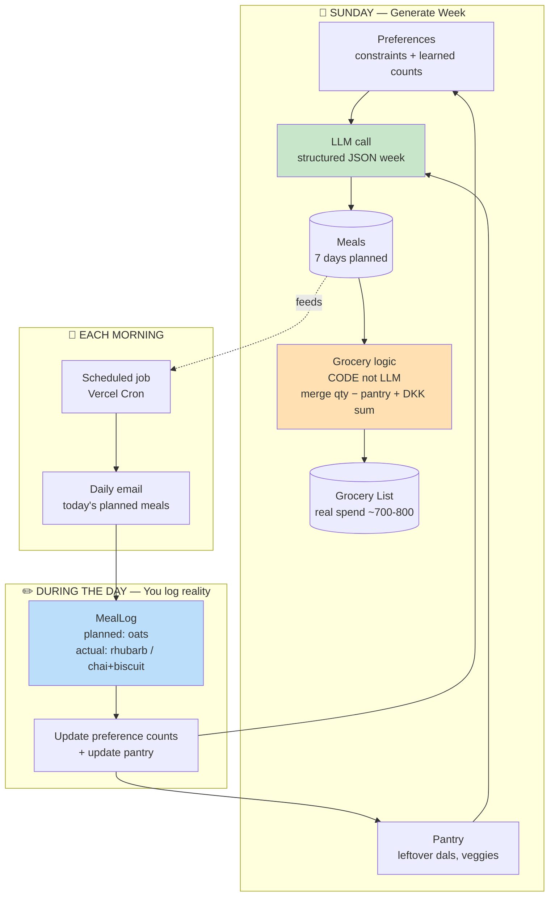

```mermaid
flowchart TD
    subgraph WEEKLY["🔁 SUNDAY — Generate Week"]
        P[Preferences<br/>constraints + learned counts] --> GEN
        PAN[Pantry<br/>leftover dals, veggies] --> GEN
        GEN[LLM call<br/>structured JSON week] --> MEALS[(Meals<br/>7 days planned)]
        MEALS --> GLOGIC[Grocery logic<br/>CODE not LLM<br/>merge qty − pantry + DKK sum]
        GLOGIC --> GLIST[(Grocery List<br/>real spend ~700-800)]
    end

    subgraph DAILY["📧 EACH MORNING"]
        CRON[Scheduled job<br/>Vercel Cron] --> EMAIL[Daily email<br/>today's planned meals]
    end

    subgraph FEEDBACK["✏️ DURING THE DAY — You log reality"]
        EMAIL --> LOG[MealLog<br/>planned: oats<br/>actual: rhubarb / chai+biscuit]
        LOG --> UPDATE[Update preference counts<br/>+ update pantry]
        UPDATE --> P
        UPDATE --> PAN
    end

    MEALS -.feeds.-> CRON
    style GLOGIC fill:#ffe0b2
    style GEN fill:#c8e6c9
    style LOG fill:#bbdefb
```
