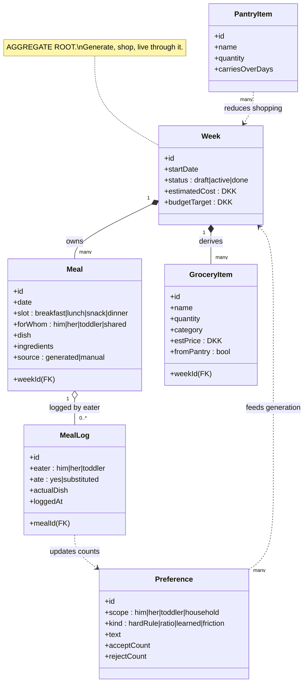

```mermaid
classDiagram
    direction TB

    class Week {
        +id
        +startDate
        +status : draft|active|done
        +estimatedCost : DKK
        +budgetTarget : DKK
    }
    note for Week "AGGREGATE ROOT.\nGenerate, shop, live through it."

    class Meal {
        +id
        +weekId  (FK)
        +date
        +slot : breakfast|lunch|snack|dinner
        +forWhom : him|her|toddler|shared
        +dish
        +ingredients
        +source : generated|manual
    }

    class MealLog {
        +id
        +mealId  (FK)
        +eater : him|her|toddler
        +ate : yes|substituted
        +actualDish
        +loggedAt
    }

    class GroceryItem {
        +id
        +weekId  (FK)
        +name
        +quantity
        +category
        +estPrice : DKK
        +fromPantry : bool
    }

    class Preference {
        +id
        +scope : him|her|toddler|household
        +kind : hardRule|ratio|learned|friction
        +text
        +acceptCount
        +rejectCount
    }

    class PantryItem {
        +id
        +name
        +quantity
        +carriesOverDays
    }

    Week "1" *-- "many" Meal : owns
    Week "1" *-- "many" GroceryItem : derives
    Meal "1" o-- "0..*" MealLog : logged by eater
    Preference "many" ..> Week : feeds generation
    PantryItem "many" ..> Week : reduces shopping
    MealLog ..> Preference : updates counts
```
